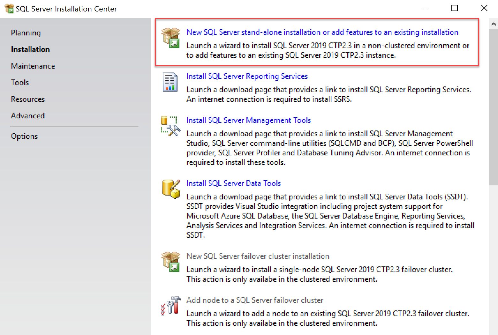
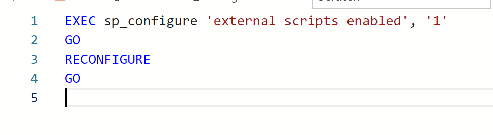
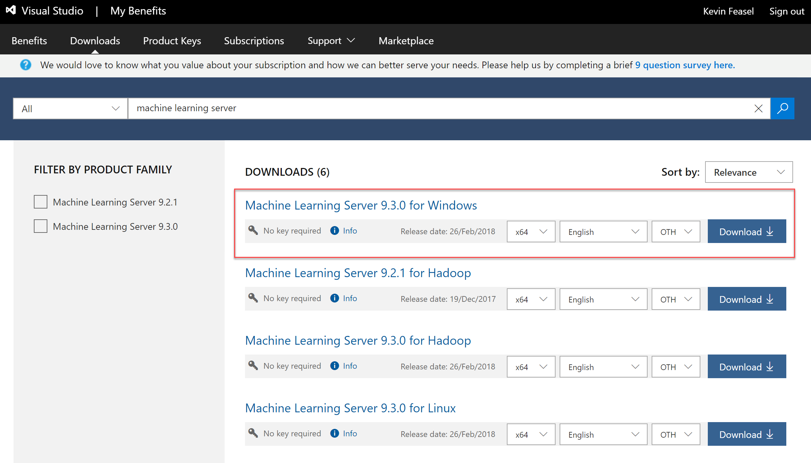
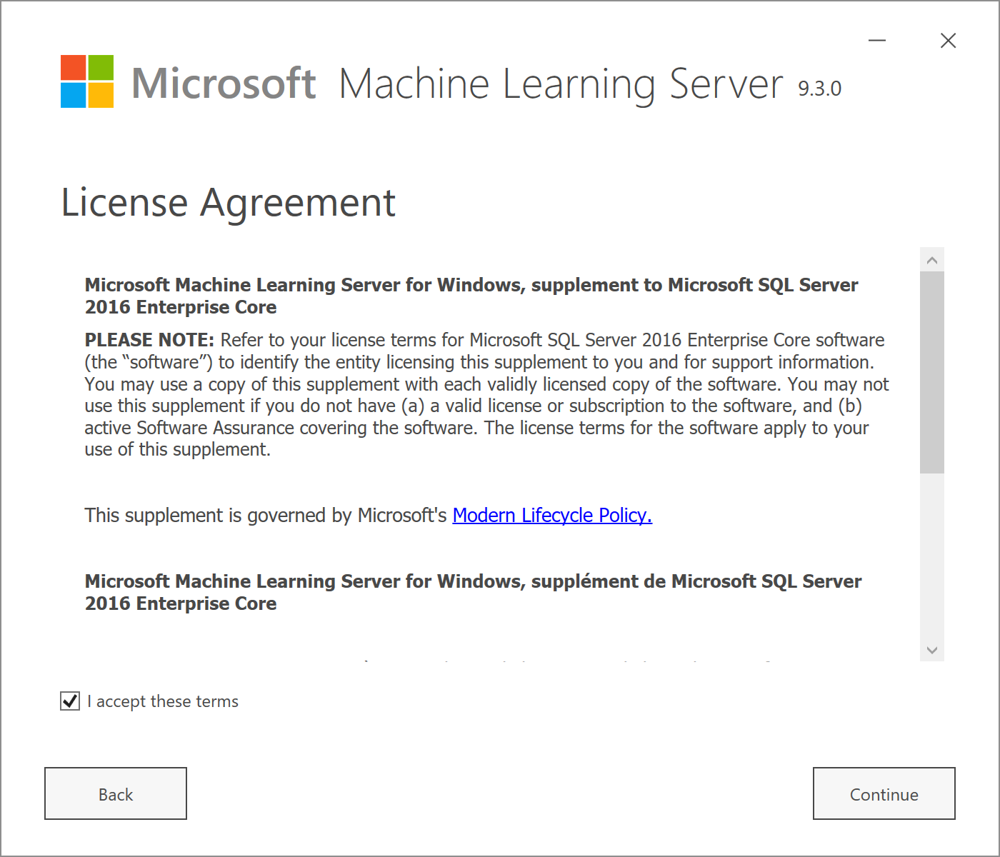
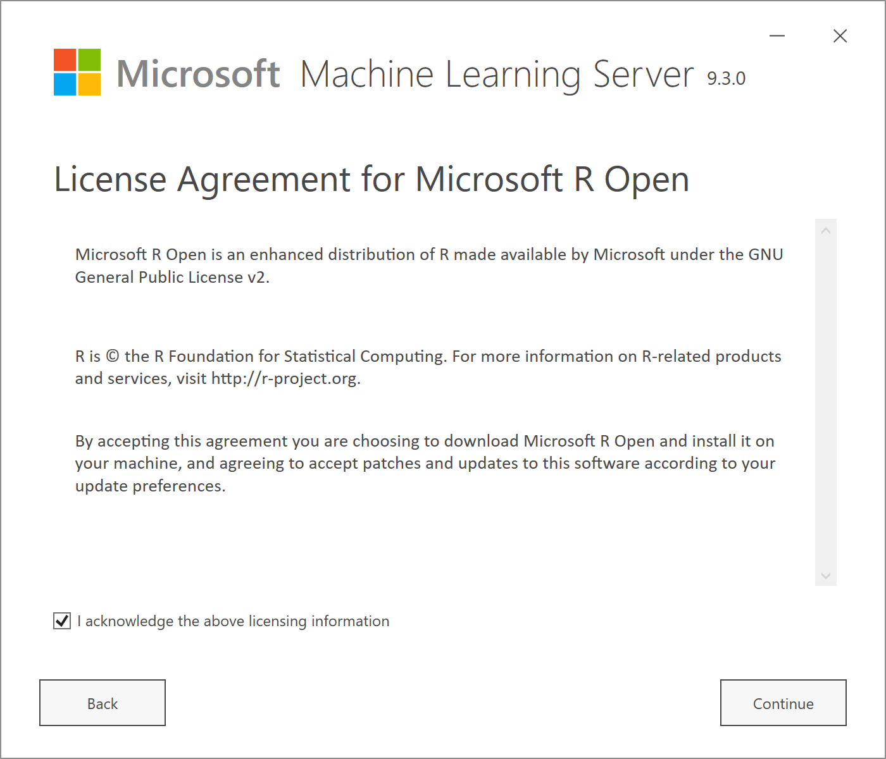
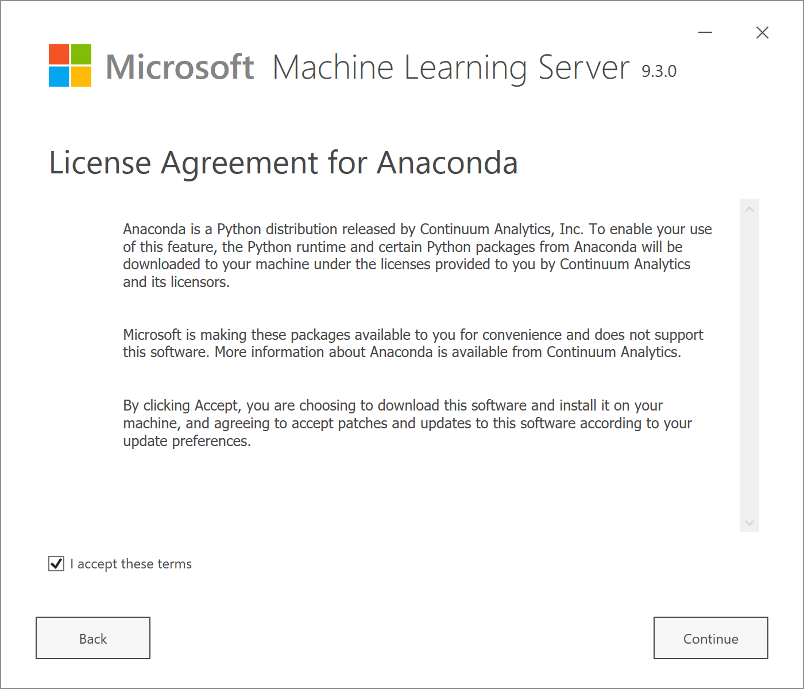
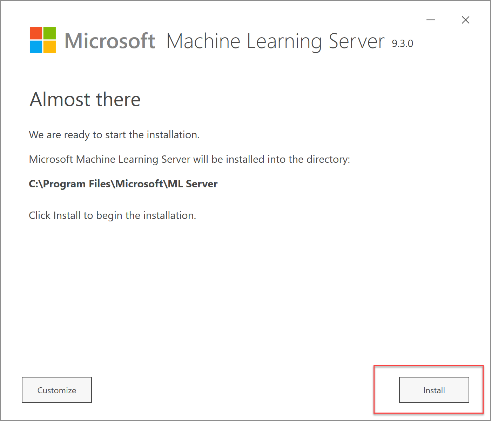
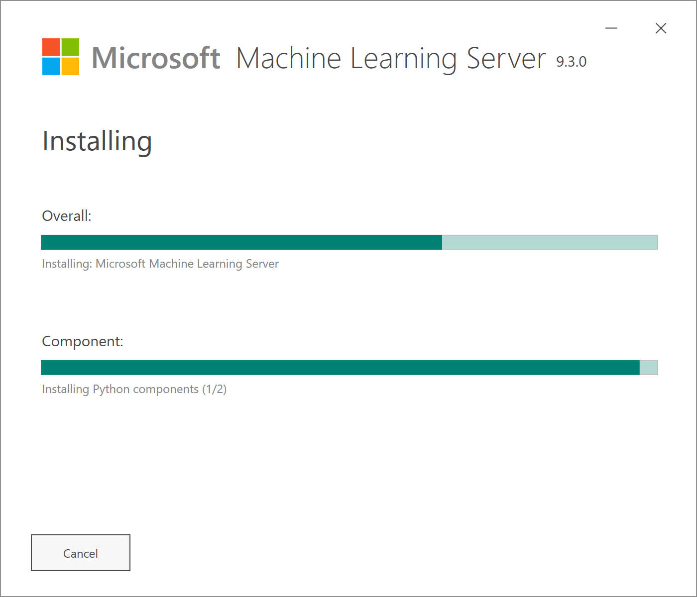

## SQL Server Machine Learning Services in Production

<a href="http://www.catallaxyservices.com">Kevin Feasel</a> (<a href="https://twitter.com/feaselkl">@feaselkl</a>) 
<a href="http://csmore.info/on/mlservices">http://CSmore.info/on/mlservices</a>

---

@title[Who Am I?]

@snap[west splitscreen]
<table>
	<tr>
		<td></td>
		<td><a href="https://csmore.info">Catallaxy Services</a></td>
	</tr>
	<tr>
		<td></td>
		<td><a href="https://curatedsql.com">Curated SQL</a></td>
	</tr>
	<tr>
		<td></td>
		<td><a href="https://wespeaklinux.com">We Speak Linux</a></td>
	</tr>
</table>
@snapend

@snap[east splitscreen]

	
	 
	<a href="http://www.twitter.com/feaselkl">@feaselkl</a>

@snapend

---?image=presentation/assets/background/questions.jpg&size=cover&opacity=20

### What is ML Services?

SQL Server Machine Learning Services (ML Services) was originally released as SQL Server R Services with SQL Server 2016.

Since then, Microsoft added support for Python in SQL Server 2017 and renamed the product accordingly.

With SQL Server 2019, Microsoft is adding Java support as well and has opened the door to other languages too.

---?image=presentation/assets/background/motivation.jpg&size=cover&opacity=20

### Motivation

My goals in this talk:

* Introduce you to SQL Server Machine Learning Services.
* Explain principles for managing external packages and deploying custom code.
* Show the security models available for ML Services.
* Provide tips on managing Machine Learning Services.

---

@title[Installing ML Services]

## Agenda
1. **Installing ML Services**
2. Managing Packages
3. Security and Roles
4. Code Management
5. Managing ML Services
6. General Tips

---

### Start a New Installation

---

### Select ML Services

---

### Enable External Scripts

---

### Restart the Launchpad

Once you have enabled external scripts, be sure to restart the Launchpad service.  To be safe, you might want to restart the SQL Server service as well.

---

@title[Managing Packages]

## Agenda
1. Installing ML Services
2. **Managing Packages**
3. Security and Roles
4. Code Management
5. Managing ML Services
6. General Tips

---?image=presentation/assets/background/blue-package.jpg&size=cover&opacity=20

## Package Management

There are several techniques for installing packages in R.  Some require direct Internet access, whereas others will allow you to install packages offline.  Some are easier to run, whereas others trade added complexity for a simpler central management story down the road.

---

### R Console

If you have **administrative access** to the machine running SQL Server, you can open up the R console and run `install.packages()` in the console.

By default, the console is installed at `%PROGRAMFILES%\Microsoft SQL Server\MSSQL14.MSSQLSERVER\R_SERVICES\bin`.

---

### sp_execute_external_script

You can execute scripts using `sp_execute_external_script`.  This includes `install.packages()`.

If you go down this route, you should keep a script with package installation steps; that way you can re-run it on different servers and maintain a log of what you have installed.

---?image=presentation/assets/background/brown-package.jpg&size=cover&opacity=20

### rxInstallPackages

The `rxInstallPackages` function is Microsoft's function for safe installation of packages.  It is a potential replacement for `install.packages()`, adding the ability to install pakages into per-database, per-user repositories.  You can call it via `sp_execute_external_script` as well.

Maintaining a log of global package installs would be helpful here as well.

---

### CREATE EXTERNAL LIBRARY

The `CREATE EXTERNAL LIBRARY` requires `GRANT ALTER ANY EXTERNAL LIBRARY` and allows you to install a package from a zip file.

---

### miniCRAN

For locked-down corporate environments, install the `miniCRAN` packages and create your own repository.  Pull packages from CRAN or MRAN as desired.  Then, use one of the prior options to install packages, pointing to this miniCRAN server as your source.

---

### Offline Options

If your SQL Servers have no outbound Internet connectivity, you can still manage packages.

One option is to set up a SQL Server with outbound access, install packages on it, and then copy the `Library` folder to your other instances.

Another option is to download zip files of your desired packages (and their dependencies) and run `install.packages` or `rxInstallPackages` to install these zipped binaries.

---?image=presentation/assets/background/demo.jpg&size=cover&opacity=20

### Demo Time

---

@title[Security and Roles]

## Agenda
1. Installing ML Services
2. Managing Packages
3. **Security and Roles**
4. Code Management
5. Managing ML Services
6. General Tips

---?image=presentation/assets/background/running.jpg&size=cover&opacity=20

### Executing Scripts

Users who wish to execute external scripts will need the `GRANT EXECUTE ANY EXTERNAL SCRIPT` permission.  Alternatively, the user may be in the `db_owner` database role or the `sysadmin` server role.

---?image=presentation/assets/background/police.jpg&size=cover&opacity=20

### Role-Based Access Control

SQL Server has a rich set of role-based access controls around things such as:

1. Reading from or writing to specific tables
2. Executing external scripts
3. Installing packages
4. Executing stored procedures
5. Running predictions with `PREDICT` or `sp_rxPredict`

---

@title[Code Management]

## Agenda
1. Installing ML Services
2. Managing Packages
3. Security and Roles
4. **Code Management**
5. Managing ML Services
6. General Tips

---?image=presentation/assets/background/sinkhole.jpg&size=cover&opacity=20

### Where Code Belongs

Putting small snippets of code in text as part of a call to `sp_execute_external_script` is fine, but as your code gets more complex, it becomes much harder to maintain for the same reasons dynamic SQL is hard to maintain.

The best option is to segregate your R or Python code from your SQL workflows as much as possible, akin to how dependency injection separates external resources from internal code.

---?image=presentation/assets/background/library.jpg&size=cover&opacity=20

### R Packages

Instead of storing all of your code in SQL queries, create a reference library with your code.  This offers a few benefits:

1. Development using R Studio is easier for your data scientists.
2. Debugging R code is much easier outside of SQL Server.
3. Packages allow you to maintain R code history better than procedures.

---?image=presentation/assets/background/demo.jpg&size=cover&opacity=20

### Demo Time

---?image=presentation/assets/background/isolation.jpg&size=cover&opacity=20

### Isolate External Script Calls

Create wrapper procedures to call the external script procedures.  This allows you to call your R or Python code within SQL Server but without any permanent results.  Doing this is critical for troubleshooting code oddities.

---?image=presentation/assets/background/shelves.jpg&size=cover&opacity=20

### Storing Models

When working with R, there are a few places we can store models and other binaries:

1. Wrapped up as files in an R package.
2. On the file system of your server.
3. Inside SQL Server.

Each comes with its own benefits and drawbacks.

---?image=presentation/assets/background/folders.jpg&size=cover&opacity=20

### Updating Code Packages

Using the package model for your custom R code allows you to perform updates with ease:  simply deploy the new zip file to the server and install the package.  Your code must not be running at the time (or else you will find the library locked), so this may be a little tricky for especially long-running processes.

For third-party libraries, `update.packages()` will update all packages.  Using one of the controlled package management techniques is best here.

---

@title[Managing ML Services]

## Agenda
1. Installing ML Services
2. Managing Packages
3. Security and Roles
4. Code Management
5. **Managing ML Services**
6. General Tips

---?image=presentation/assets/background/binders.jpg&size=cover&opacity=20

### Upgrading R or Python

SQL Server ships with specific versions of R and Python.  If you wish to upgrade, you will need to bind a new version of Microsoft Machine Learning Server to SQL Server.

There are a few steps to binding.  These instructions are for SQL Server 2017; 2016 had its own process which differed a bit from 2017.

---

### Download ML Server

---

### Bind to SQL Server

---

### Accept License Terms

---

### Accept R Open License

---

### Accept Anaconda License

---

### Install

---

### Wait For Completion

---?image=presentation/assets/background/rocket.jpg&size=cover&opacity=20

### Restart the Launchpad

Once you have enabled external scripts, be sure to restart the Launchpad service.  To be safe, you might want to restart the SQL Server service as well.

---?image=presentation/assets/background/hotel-governor.jpg&size=cover&opacity=20

### Using Resoure Governor

Machine Learning Services can eat up CPU and memory outside of SQL Server.  In heavy utilization cases, it might crowd out SQL Server and cause a degradation in experience.

To prevent this, use the Resource Governor, which can control CPU, memory, and I/O utilization for external scripts.

---?image=presentation/assets/background/lake.jpg&size=cover&opacity=20

### External Pools

Resource Governor has regular pools for controlling SQL Server behavior and external pools for controlling the Launchpad.  We can create resource pools and classifier functions to segregate sessions into these pools.  They can help you keep a busy server from falling over due to a poorly-timed dev query.

---?image=presentation/assets/background/demo.jpg&size=cover&opacity=20

### Demo Time

---?image=presentation/assets/background/binoculars.jpg&size=cover&opacity=20

### DMVs and Administration

Machine Learning Services offers a few Dynamic Management Views (DMVs) which help you gain insight on what external scripts are doing.  You can also use `sp_WhoIsActive` to see how your external scripts are performing.

There are also files in your SQL Server logs folder, underneath an `ExtensibilityLog` folder, which can help you diagnose errors with R or Python integration.

---?image=presentation/assets/background/demo.jpg&size=cover&opacity=20

### Demo Time

---?image=presentation/assets/background/cleaning.jpg&size=cover&opacity=20

### File Cleanup

Temporary data for ML Services runs are stored in an Extensibility Data folder.  For 2019, it is in `C:\SQL-MSSQLSERVER-ExtensibilityData\AppContainer[0-20]`

For 2017, it is in `%PROGRAMFILES%\MSSQL14.MSSQLSERVER\MSSQL\ ExtensibilityData\MSSQLSERVER[00-20]` by default.  Each run creates a subfolder in one of the container folders.

---?image=presentation/assets/background/time.jpg&size=cover&opacity=20

### File Cleanup

When you restart the Launchpad service, it deletes these subfolders, but if you have huge numbers of them, the delete operation may not finish in time for the service to restart.  We have a scheduled task which runs occasionally and deletes the subfolders when they are more than a day old.  Once an ML Services task is complete, it no longer needs anything in this subfolder so they are safe to delete.

---

@title[General Tips]

## Agenda
1. Installing ML Services
2. Managing Packages
3. Security and Roles
4. Code Management
5. Managing ML Services
6. **General Tips**

---?image=presentation/assets/background/jump.jpg&size=cover&opacity=20

### What Works Well

These kinds of scenarios work really well with SQL Server ML Services:

1. Your input data is already in SQL Server.
2. You have longer-running processes (batch training or scoring).
3. You can use native scoring with the `PREDICT` operator.
4. You want to interact with R using .NET code.
5. You do not need real-time interactivity.

---?image=presentation/assets/background/surfer-crash.jpg&size=cover&opacity=25

### What Doesn't Work

Avoid these scenarios:

1. You need singleton, near real-time predictions AND cannot use native scoring.
2. None of your core data is inside SQL Server.
3. Your SQL Server instance is already at near 100% CPU.

---

### RevoScaleR Versus Core R

My biases:

1. Core R is better ceteris paribus due to portability.
2. If you can use native scoring, RevoScaleR is completely worth it.
3. Extended Data Frames (XDF) are sometimes a necessary evil.
4. Some RevoScaleR models (especially neural networks) are weak.
5. If you need parallel processing, RevoScaleR is a good bet.

---?image=presentation/assets/background/repetition.jpg&size=cover&opacity=20

### Parallel Processing

`sp_execute_external_script` has an `@parallel` option to try to parallelize non-RevoScaleR operations which can work with single rows of data independent of other rows--batch predictions, for example.  This can speed up certain operations considerably...but so could using RevoScaleR functions, where parallelism is on by default.

---?image=presentation/assets/background/wrappingup.jpg&size=cover&opacity=20

### Wrapping Up

SQL Server Machine Learning Services offers the ability to operationalize R or Python effectively, though it is not without its challenges.

To learn more, go here:  <a href="http://csmore.info/on/r">http://CSmore.info/on/mlservices</a>

And for help, contact me:  <a href="mailto:feasel@catallaxyservices.com">feasel@catallaxyservices.com</a> | <a href="https://www.twitter.com/feaselkl">@feaselkl</a>
